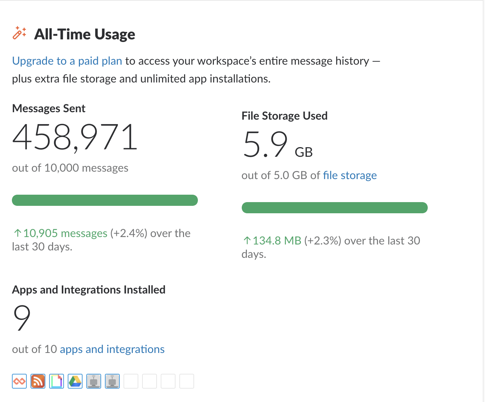
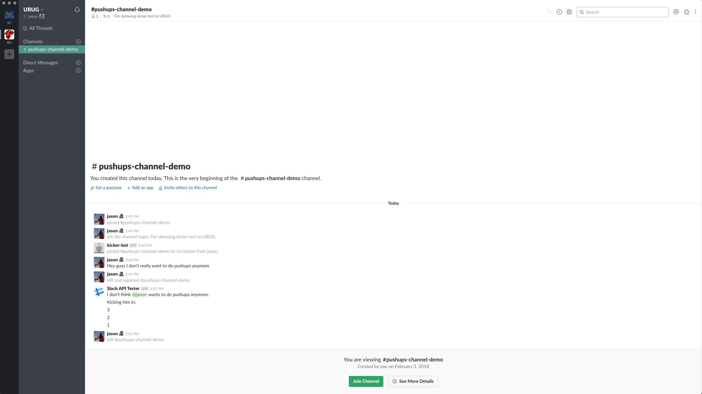
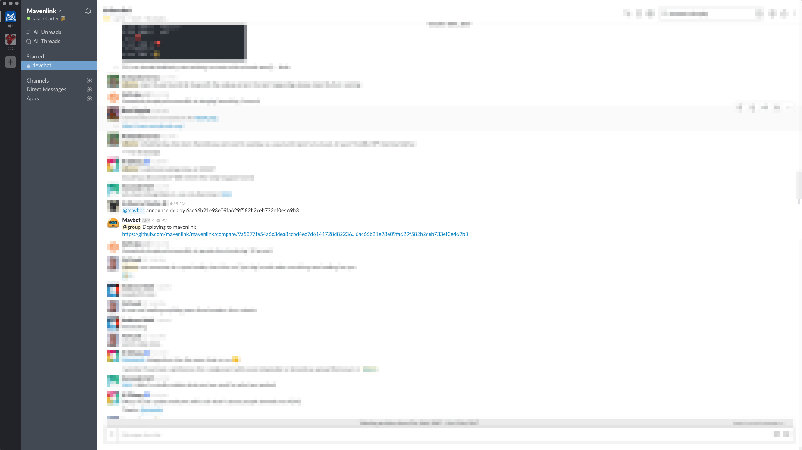
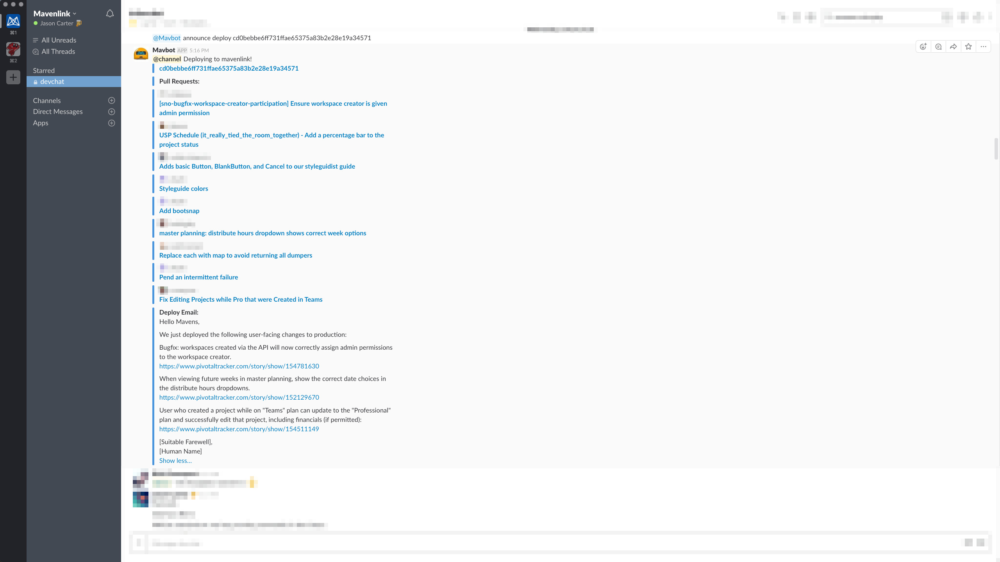
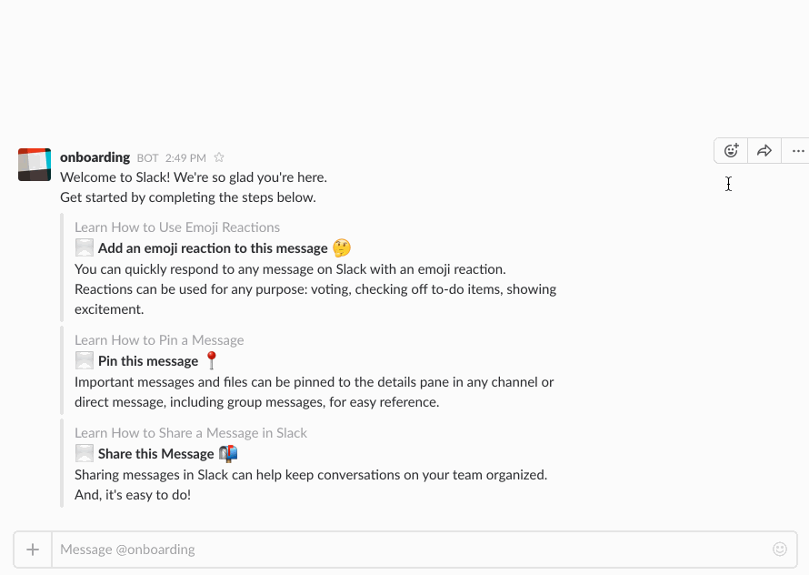
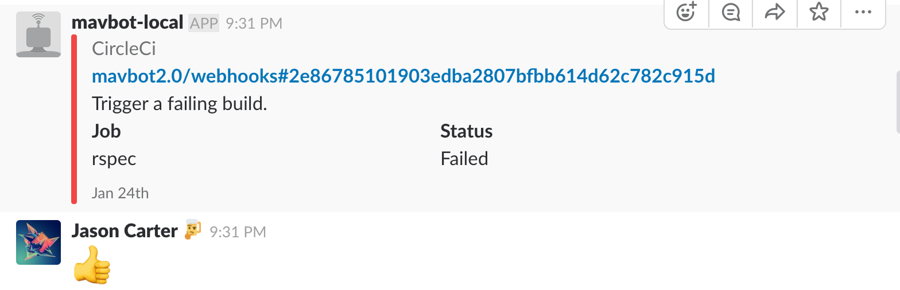
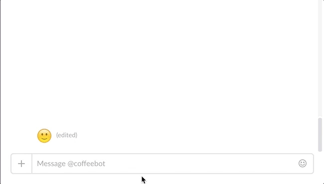

# Slackbots in Ruby
### Welcoming our new robot overlords

---

## Jason Carter
## Software Engineer at Mavenlink

---

# Slack

---

# Utah Ruby Users Group

---

---

---

---

## How can we build *better tools* to support this community?

---

## We'll discuss:
- How I got into building Slackbots
- Building a Slackbot in Ruby
- Advanced possibilities

---

## Afterwards, we'll have time to hack on our own bots!

---

# How I got into building Slackbots

---

## At its core, software development is about _solving problems_ for users with `code`

---

## Some problems are a little _petty_

---

## Phil keeps getting invited back to the #pushups channel

---

---

## And thus a love of slackbots was born...

---

### Deleter Bot - Delete all my messages in a channel
### Notifier Bot - @channel in slack when @channel has been disabled by an admin

---

# What other problems can we solve?

---

---

# It's hard to know...
---

# _when_ someone has deployed to production

---

# _what_ someone has deployed to production

---

# Introducing...

---

# Mavbot

---

---

## Writing deploy emails is painful!

---

---

# At Mavenlink, I'm working on solving a few more problems
- Asynchronously planning retros and hosting standups
- Notifying the wider dev organization when master is red
- Allowing devs to ask Mavbot what Code Reviews they've been assigned to

---

## However did you do it!?

---

# Building a Slackbot in Ruby

---

# Ruby Tools
- [slack-ruby-client](https://github.com/slack-ruby/slack-ruby-client)
- [slack-ruby-bot](https://github.com/slack-ruby/slack-ruby-bot)
- [slack-ruby-server](https://github.com/slack-ruby/slack-ruby-server)

---

## We're going to focus on Slack Ruby Bot

---

# Let's solve another problem!

---

---

## [fit] `@reddit-bot reddit politics rising`

---

- Listen for a command
- Parse out two args `:subreddit` and `:filter`
- Make an API call
- Return pretty output
- Handle server errors

---

# Demo time!

---

## What else is possible?
- API
- Respond to events
- Webhooks
- Message Menus
- Dialogs

---

---

---

---

---

---

## What _problems_ do we have as a community, and _could a bot help_?

---

# Fin

---

# Articles
- [Top Bots on Slack](https://botlist.co/platforms/slack/most-viewed)
- [Using Message Menus in a Production Bot](https://medium.com/slack-developer-blog/bringing-bot-interaction-to-a-new-level-d49f99169a03)
- [Introduction to Dialogues](https://medium.com/slack-developer-blog/building-more-intricate-workflows-in-slack-with-dialogs-74f122ed887c)

---

# Tools
- [Protoype Converstations with Walkie](https://walkiebot.co/)

---

# References
- [Slack API](https://api.slack.com)
- [sample-message-menus-app](https://github.com/slackapi/sample-message-menus)
- [sample-onboarding-app](https://github.com/slackapi/Slack-Ruby-Onboarding-Tutorial)

