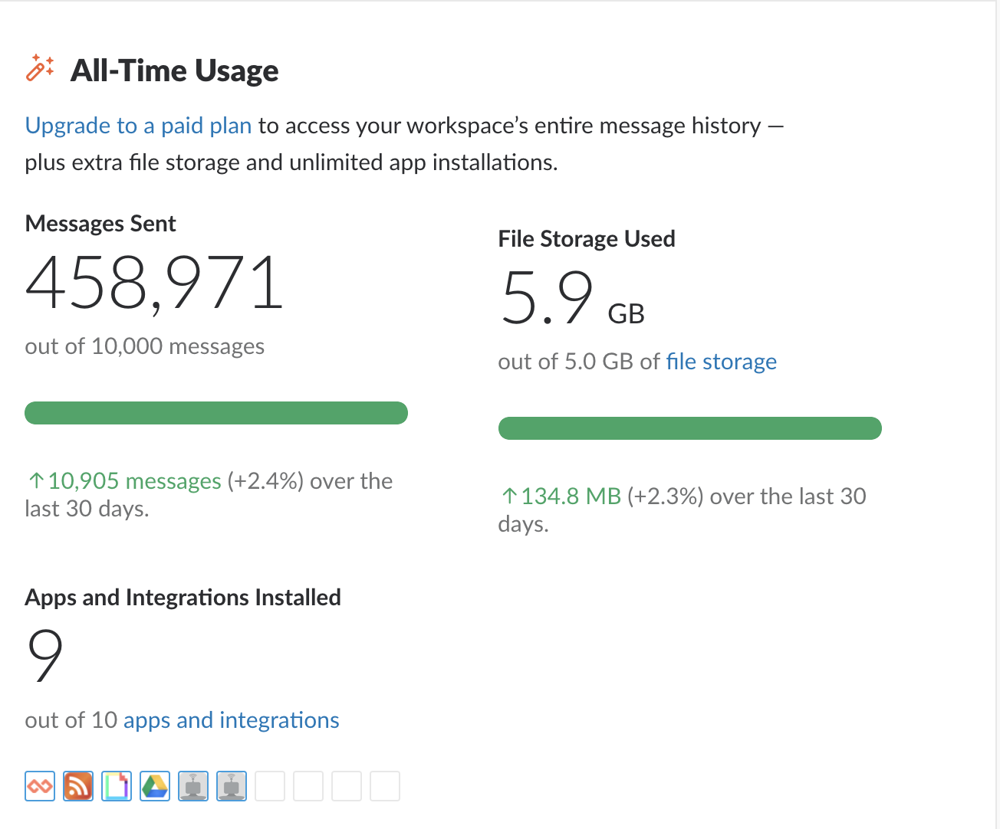
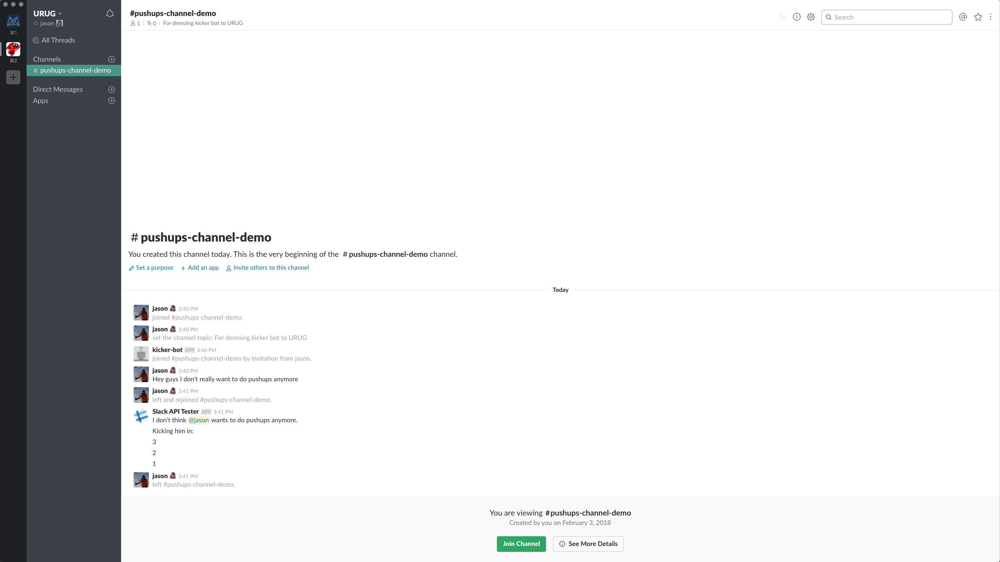
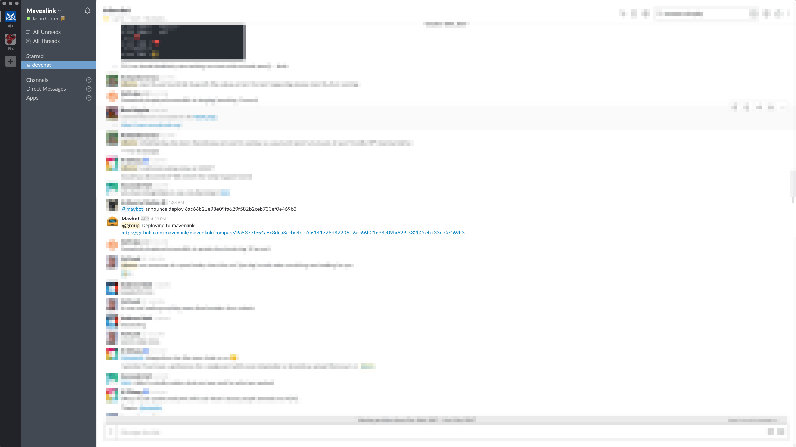
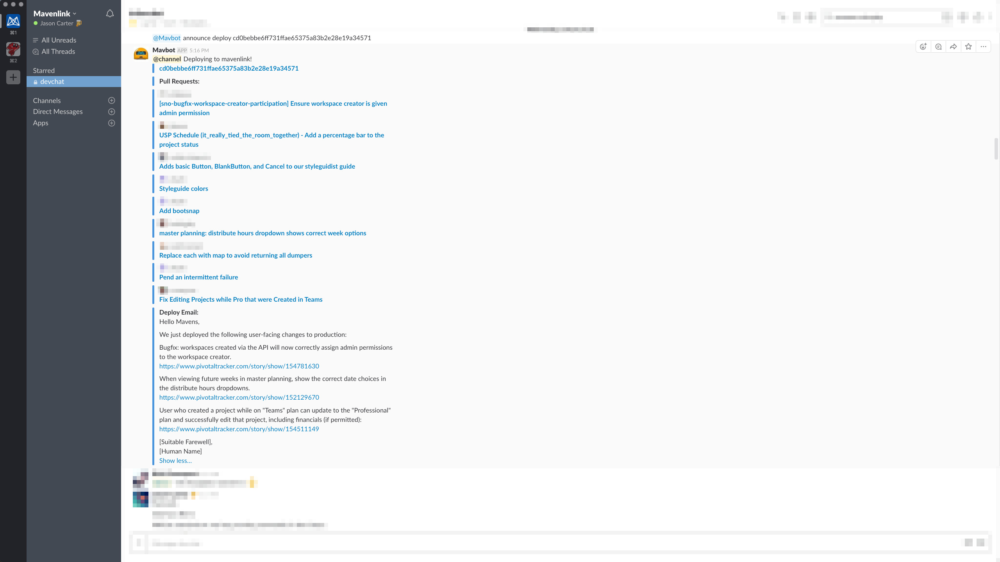

# Slackbots in Ruby
### Welcoming our new robot overlords

---

# Slack

---

# Utah Ruby Users Group

---

---

---

---

# How can we build better tools to support this community?

---

## We'll discuss:
- How I got into building Slackbots
- Building a Slackbot in Ruby
- Advanced possibilities

---

# How I got into building Slackbots

---

## At its core, software development is about solving problems for users with code

---

## Some problems are a little _petty_

---

## Phil keeps getting invited back to the #pushups channel

---

---

## And thus a love of slackbots was born...

---

### Deleter Bot - Delete all my messages in a channel
### Notifier Bot - @channel in slack when @channel has been disabled by an admin (looking at you Holdy)

---

# Lets solve a better problem!

---

# It's hard to know _when_ someone has deployed to production

---

# It's hard to know _what_ someone has deployed to production

---

# Introducing...

---

# Mavbot

---

---

## Writing deploy emails is painful!

---

---

# At Mavenlink, I'm working on solving a few more problems
- Asynchronously planning retros and hosting standups
- Notifying the wider dev organization when master is red
- Allowing devs to ask Mavbot what Code Reviews they've been assigned to

---

# Building a Slackbot in Ruby

---

# Ruby Tools
- [slack-ruby-client](https://github.com/slack-ruby/slack-ruby-client)
- [slack-ruby-bot](https://github.com/slack-ruby/slack-ruby-bot)
- [slack-ruby-server](https://github.com/slack-ruby/slack-ruby-server)

---

## We're going to focus on Slack Ruby Bot

---

## Slack Ruby Bot
- Commands
- Listeners
- MVC

---

# An example bot
- @urugbot reddit politics hot

---

# An example bot
- Listen for a command
- Parse out two args `:subreddit` and `:filter`
- Make an API call
- Return pretty output

---

# Demo time!

---

## What more can I do?
- API
- Respond to events
- Webhooks
- Messages and Dialogs

---

# API
- What if your bot could talk to a rails app?
- Meetup submissions and tracking through the Rails app?

---

# Respond to events
- What if your bot could welcome new members and point them to channels?
- Get them to introduce themselves?

---

# Webhooks
- What if your bot could respond Meetup webhooks and post when a new meetup is announced?

---

# Messages and Dialogs

---

